<br>

# App Gestión de Microelectrónica
Aplicación Web para la Gestión de Productos de Microelectrónica implementando Spring Boot, Spring Data JPA, Maven, Lombok, Log4J, Thymeleaf, Bootstrap, JS Vanilla, Oracle y Otras Tecnologías.

<br>

## Índice 📜 

<details>
 <summary> Ver </summary>
 
 <br>
 
### Sección 1) Descripción, Tecnologías y Dependencias 
 
 - [1.0) Descripción del Proyecto.](#10-descripción-)
 - [1.1) Patrones de Diseño.](#11-patrones-de-diseño-)
 - [1.2) Tecnologías.](#12-tecnologías-)
     - [1.2.1) Descargas.](#121-descargas)
 - [1.3) Dependencias Maven.](#13-dependencias-maven-)
 
### Sección 2) Endpoints y Recursos 
 
 - [2.0) EndPoints.](#endpoints-)
 - [2.1) Recursos y Servicios.](#recursos-y-servicios-)
 
 
### Sección 3) Prueba de Funcionalidad y Referencias
 
 - [3.0) Prueba de Funcionalidad.](#30-prueba-de-funcionalidad-)
 - [3.1) Referencias.](#31-referencias-)
	
### Sección 4) Creación y Configuración Proyecto Spring Boot desde cero
 
 - [4.0) Creación con Maven en Spring Tool Suite 4.](#40-creación-con-maven-en-spring-tool-suite-4-)
 - [4.1) Otras Configuraciones del Proyecto.](#41-otras-configuraciones-del-proyecto-)

<br>

</details>

<br>

## Sección 1) Descripción, Tecnologías y Dependencias 


### 1.0) Descripción [🔝](#índice-) 

<details>
 <summary></summary>
 
 <br>

* La aplicación consta de todas las Operaciones CRUD a Nivel DB, Paginación de Componentes, Filtros y Búsqueda, Ordenamientos por campos, Generación de Reportes en PDF con openPDF y Excel con Apache POI, Generación de Gráficos de Barras y Áreas con High Charts según el stock del producto en relación al fabricante o categoría, etc. 
* Se pone a disposición todos los recursos anteriores para únicamente la Tabla Componentes de la Base de Datos.
* `Importante` : La api de este proyecto, desarrolada en su versión V1 está incluida dentro de esta app. En el proyecto se aplica la lógica similar a la original con nuevas funcionalidades para las vistas, controllers, etc. También los recursos necesarios para el uso de Thymeleaf.

<br>

* [Base de Datos del Proyecto](https://github.com/andresWeitzel/db_microelectronica_Oracle).
* [PlayList para la Comprobación de Funcionalidades](https://www.youtube.com/playlist?list=PLCl11UFjHurAhsy9K0G0TIBmiSSqP_lN3)
* La Api Rest de este proyecto está incluida

<br>

</details>


### 1.1) Patrones de Diseño [🔝](#índice-) 

<details>
 <summary></summary>
 
 <br>

| **Patrón de Diseño** | **Finalidad** |               
| ------------- | ------------- |
| [DAO](https://www.oscarblancarteblog.com/2018/12/10/data-access-object-dao-pattern/) | Uso de interfaces entre la aplicación y el almacenamiento de datos. |
| [MVC](https://keepcoding.io/blog/que-es-el-patron-de-arquitectura-mvvm/) | Separación y Representación de los Datos, Manejo de errores, Escalabilidad, etc  |

<br>

</details>


### 1.2) Tecnologías [🔝](#índice-)

<details>
 <summary></summary>
 
 <br>

| **Tecnologías** | **Versión** | **Finalidad** |               
| ------------- | ------------- | ------------- |
| [Java](https://docs.oracle.com/en/) |  12.0.2 | JDK |
| [Spring Tool Suite 4](https://spring.io/blog/2021/06/21/spring-tools-4-11-0-released) | 4.9.0  | IDE |
| [Spring Boot](https://spring.io/) |  2.6.4  | Framework |
| [Spring Boot Data JPA](https://spring.io/projects/spring-data-jpa)  | 2.6.3 | Mapeo de objetos y persistencia en la db |
| [Spring Validation](https://www.baeldung.com/spring-boot-bean-validation)  | 2.7 | Anotations para Validaciones |
| [Bootstrap](https://getbootstrap.com/docs/5.2/getting-started/introduction/) | 5.1 | Framework Maquetación |
| [Thymeleaf](https://www.thymeleaf.org/) | 2.6.4 | Plantillas para el Front | 
| [Maven](https://maven.apache.org/) |  4.0.0 | Gestor de Proyectos |
| [Lombok](https://projectlombok.org/) | 1.18.22 | Automatización de Código | 
| [UI Swagger](https://swagger.io/tools/swagger-ui/) | 3.0.0 | Visualización y Gestión de la Api | 
| [Postman](https://www.postman.com/) | 9.1.1 | Visualización y Gestión de la Api | 
| [Oracle XE 21c](https://www.oracle.com/database/technologies/appdev/xe.html#:~:text=Whether%20you%20are%20a%20developer,and%20a%20full%2Dfeatured%20experience.) | 21.4.1 | Sistema de Gestión de Bases de Datos |
| [SQL Developer](https://www.oracle.com/database/sqldeveloper/) | 21.4.1  | Editor de Base de Datos |
| [CMD](https://learn.microsoft.com/en-us/windows-server/administration/windows-commands/cmd) | 10 | Símbolo del Sistema para linea de comandos | 
| [GNU bash / Terminal](https://www.gnu.org/software/bash/) | 4.4.23  | Bash / Terminal para el manejo e implementación de Git integrado al Spring Tool Suite | 
| [Git](https://git-scm.com/) | 2.29.1  | Control de Versiones |

<br>

</details>

### 1.2.1) Descargas [🔝](#índice-)

<details>
 <summary></summary>
 
 <br>
 
* [Java-JDK 12](https://www.oracle.com/java/technologies/javase/jdk12-archive-downloads.html)
* [Spring Tool Suite 4](https://spring.io/tools)
* [Lombok](https://projectlombok.org/download )
* [Postman](https://www.postman.com/downloads/)
* [Oracle](https://www.oracle.com/database/technologies/oracle21c-windows-downloads.html)
* [SQL Developer](https://www.oracle.com/tools/downloads/sqldev-downloads.html)
* [MongoDB Compass](https://www.mongodb.com/try/download/compass)
* [Git](https://git-scm.com/downloads)


<br>

</details>


### 1.3) Dependencias Maven [🔝](#índice-)

<details>
 <summary></summary>
 
 <br>

| **Dependencia Maven**  | **Versión** | **Finalidad** |             
| ------------- | ------------- | ------------- |
| spring-boot-starter-data-jpa | 2.6.7 | Api de JpaRepository para el manejo de métodos | 
| spring-boot-starter-test | 2.6.7 | Para Testing | 
| spring-boot-starter-web | 2.6.7 | Se agrega toda la configuración web automáticamente de Maven a Spring | 
| spring-boot-starter-validation | 2.7.0 | Validación de Annotations |
| spring-boot-devtools | 2.6.7 | Herramientas para el Manejo de Spring Boot | 
| spring-boot-starter-thymeleaf | 2.6.4 | Plantillas para el Front |
| jaxb-api | 4.0 | Serialización de Objetos Java a XML |
| jackson-databind | 4.0 | Serialización de Objetos Java a JSON |
| javax-annotation-api | 4.0 | Api para la lectura de annotations|
| ojdbc8 | 21.3.0.0 | Driver para el SGDB Oracle | 
| lombok | 1.18.22 |  Dependencia para la automatización de Código |
| openpdf | 1.3.27 |  Generación de Reportes en Formato PDF |
| poi | 5.2.0 |  Generación de Reportes en Formato EXCEL |
| poi-ooxml | 5.2.0 |  Manejo de  Recursos Formato EXCEL |
| springfox-swagger-ui | 3.0.0 | Doc Api |
| postgresql | 42.3.4 | Driver para el SGDB PostgreSQL | 
| lombok | 1.18.22 |  Dependencia para la automatización de Código |

<br>

</details>


<br>


## Sección 2) EndPoints y Recursos

### 2.0) EndPoints [🔝](#índice-)

<details>
 <summary></summary>
 
* http://localhost:8098/v1/componentes
* http://localhost:8098/v1/componentes-detalles
* http://localhost:8098/v1/componentes-transistores-bipolares
* http://localhost:8098/v1/componentes-capacitores-electroliticos

<br>

</details>


### 2.1) Recursos y Servicios [🔝](#índice-)

<details>
 <summary></summary>

### Inicio Componentes

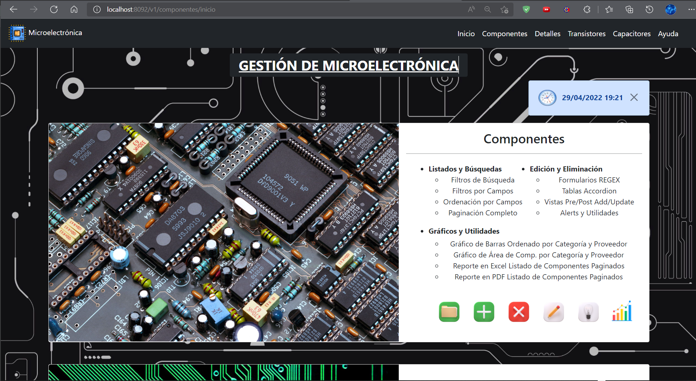

### Gráficos de Área y Barra para Stock de Componentes por Categoría y Fabricante

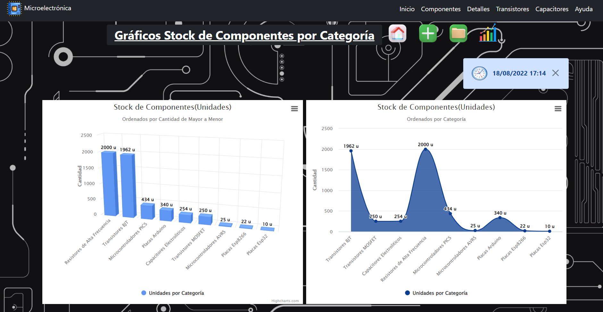


### Reportes en Excel y PDF para el Listado de Componentes Paginados según N° de Página

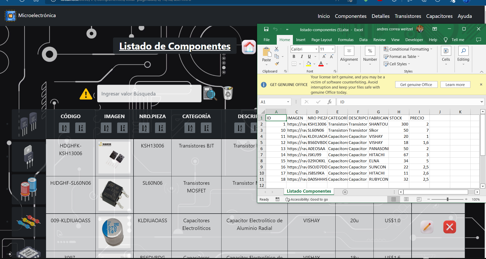
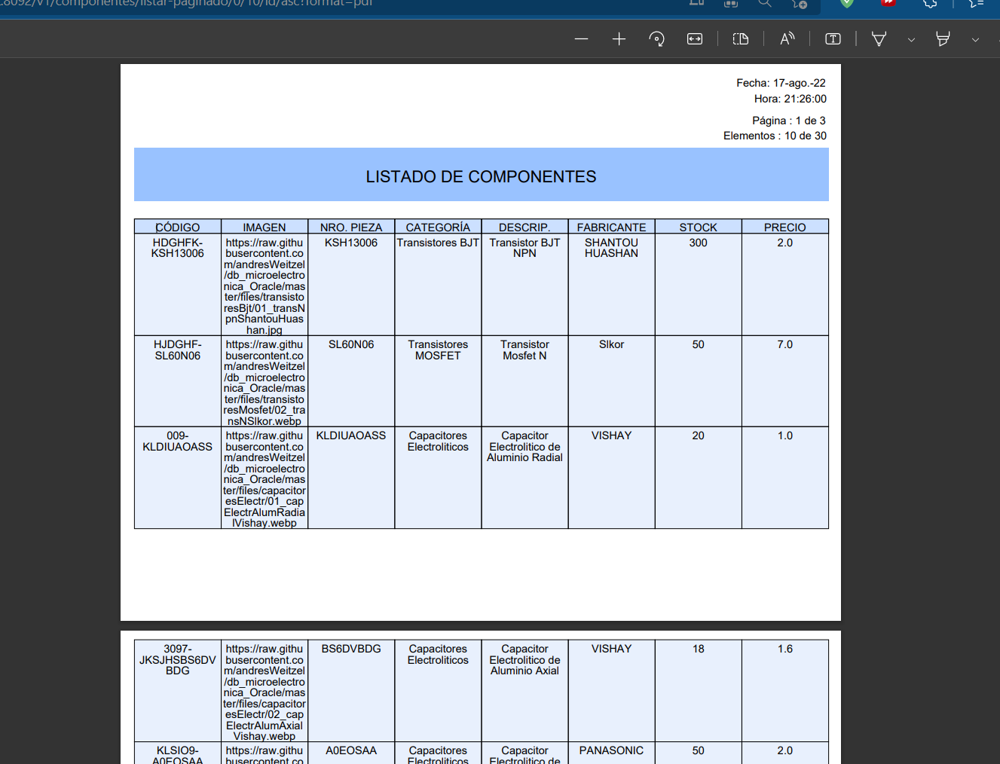
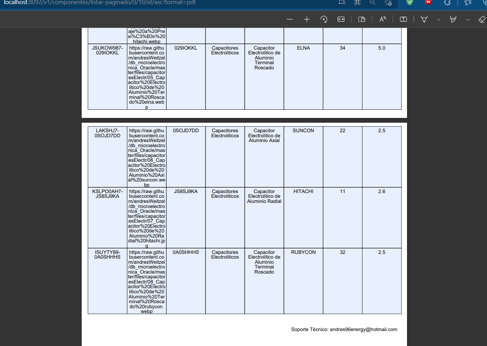

### Listado de Componentes Paginados

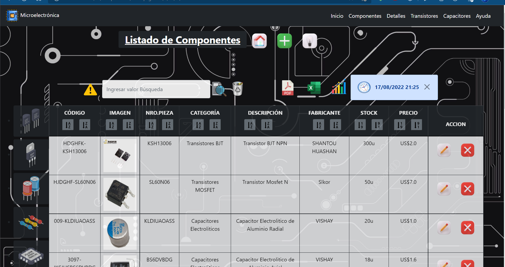
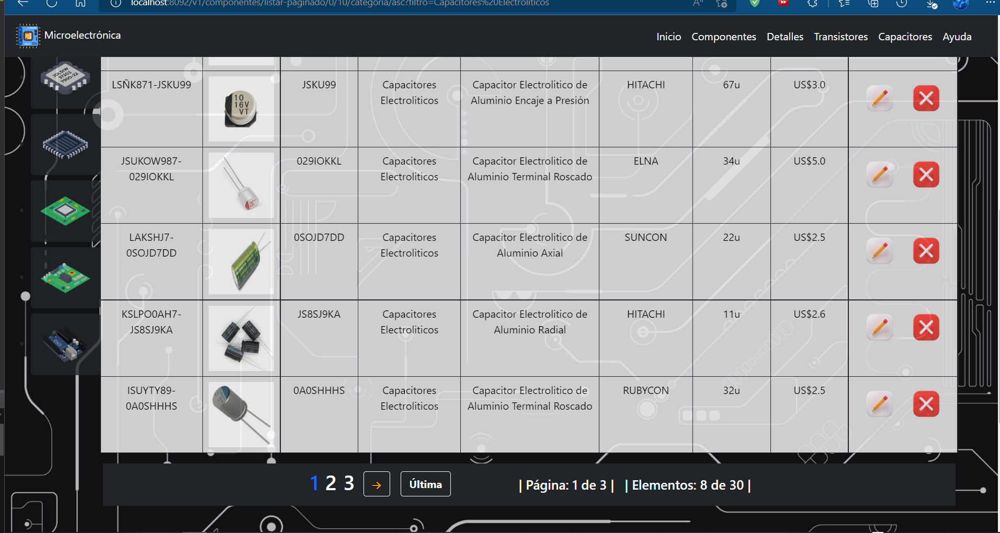


### Filtrado de Componentes por Capacitores Electrolíticos

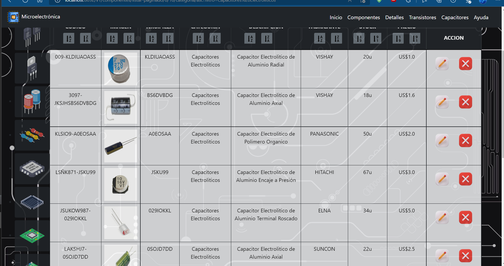


### Formulario Agregar Componente
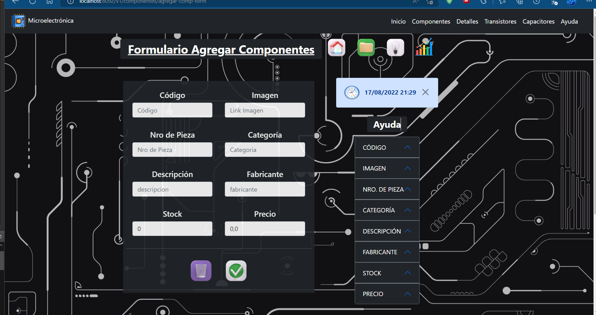

### Vista Eliminar Componente
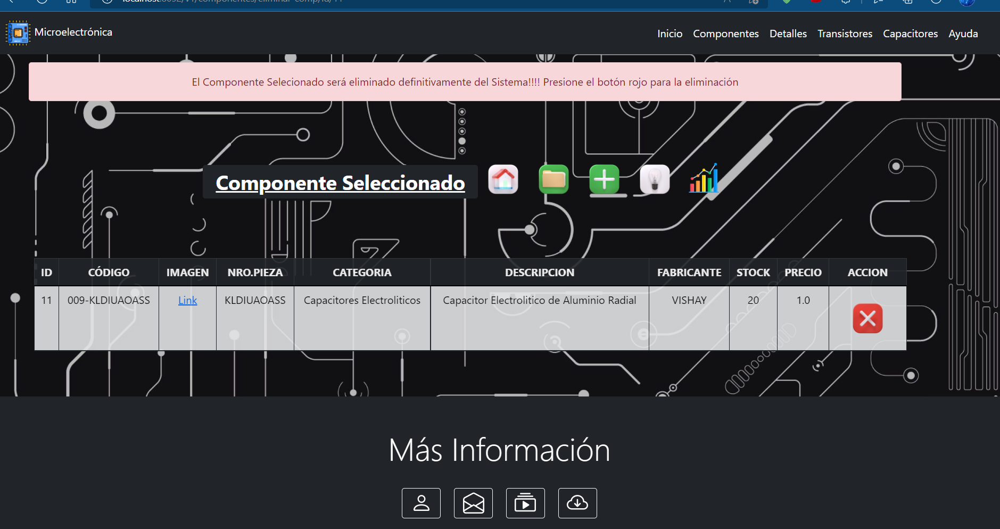


### Vista Post Actualización de Componente
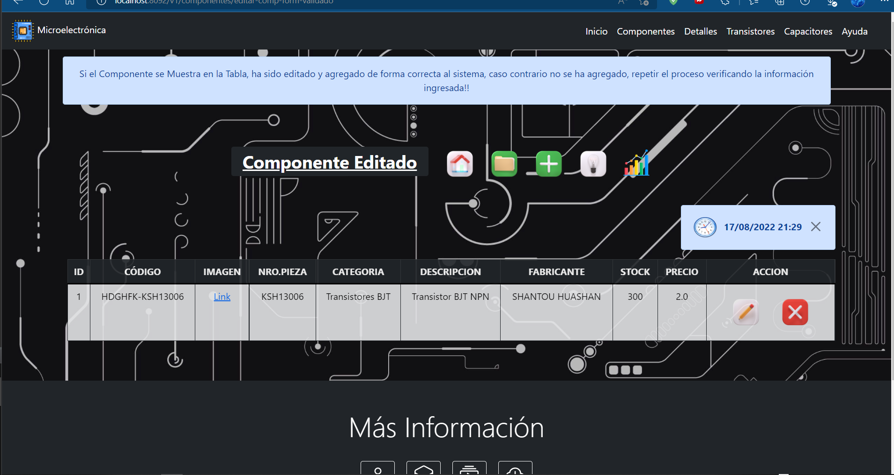


### Vista Servicio de Ayuda
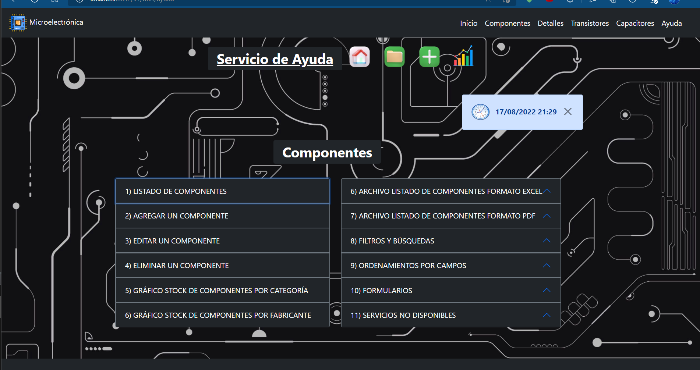

 <br>

</details>


<br>


## Sección 3) Prueba de Funcionalidad y Referencias


### 3.0) Prueba de Funcionalidad [🔝](#índice-)

<details>
 <summary></summary>

### Vistas y Funcionalidades Generales
[](https://www.youtube.com/watch?v=dzbY89HAXCU&list=PLCl11UFjHurAhsy9K0G0TIBmiSSqP_lN3&index=1) 


### Tabla y Filtros de Componentes por Categoría
[](https://www.youtube.com/watch?v=xSXhPNUD_Nk&list=PLCl11UFjHurAhsy9K0G0TIBmiSSqP_lN3&index=2) 


### Buscador de Componentes con Filtro Genérico
[](https://www.youtube.com/watch?v=O4Z0GXbP63Y&list=PLCl11UFjHurAhsy9K0G0TIBmiSSqP_lN3&index=3) 


### Paginación de Componentes y Ordenamientos
[](https://www.youtube.com/watch?v=HbFeZKLEq1I&list=PLCl11UFjHurAhsy9K0G0TIBmiSSqP_lN3&index=4) 


### Descarga de Componentes Archivos PDF y XLSX
[](https://www.youtube.com/watch?v=pitT4UjD4lk&list=PLCl11UFjHurAhsy9K0G0TIBmiSSqP_lN3&index=5) 


### Gráficos de BarraÁrea Stock de Comp. por Categoría
[](https://www.youtube.com/watch?v=d1zDf0tW7qU&list=PLCl11UFjHurAhsy9K0G0TIBmiSSqP_lN3&index=6) 


### Gráficos de BarraÁrea Stock de Comp. por Fabricante
[](https://www.youtube.com/watch?v=WM6qJ-HWFnQ&list=PLCl11UFjHurAhsy9K0G0TIBmiSSqP_lN3&index=7) 


### TablasGuías de Ayuda
[](https://www.youtube.com/watch?v=fhblPvBTqw4&list=PLCl11UFjHurAhsy9K0G0TIBmiSSqP_lN3&index=8) 


### Formulario Agregar Componentes (Parte01)
[.png)](https://www.youtube.com/watch?v=4KvZ9VMrFZI&list=PLCl11UFjHurAhsy9K0G0TIBmiSSqP_lN3&index=9) 


### Formulario Agregar Componentes (Parte02)
[.png)](https://www.youtube.com/watch?v=Bp4fS3mFjlU&list=PLCl11UFjHurAhsy9K0G0TIBmiSSqP_lN3&index=10) 

### Eliminar Componentes
[](https://www.youtube.com/watch?v=noSgm4c8iFk&list=PLCl11UFjHurAhsy9K0G0TIBmiSSqP_lN3&index=11) 


###  Formulario Actualizar Componentes
[](https://www.youtube.com/watch?v=FCKgRe7esj8&list=PLCl11UFjHurAhsy9K0G0TIBmiSSqP_lN3&index=12) 

 <br>

</details>


### 3.1) Referencias [🔝](#índice-)

<details>
 <summary></summary>

### Doc No Oficial Recomendada
 
#### Api Rest con Thymeleaf/ Spring Boot
* [Api Rest Spring Boot thynmeleaf](https://www.udemy.com/course/spring-boot-thymeleaf-mysql-mongodb-api-rest/)
* [Casos de Usos](https://www.quora.com/Can-you-make-a-REST-API-in-Spring-Boot-having-Thymeleaf-as-the-view-template-in-that-case-what-is-the-benefit-for-it-to-be-a-rest-API-instead-of-a-traditional-MVC)
* [Crud Thymeleaf](https://www.baeldung.com/spring-boot-crud-thymeleaf)

### Doc Gráfica No Oficial Recomendada
* [Crud](https://www.youtube.com/watch?v=oF3XmiHgT-I&list=PL_8FSlpwPBDmFEy9Rcj2M_OZTc2NJvfpz)
* [Spring MVC](https://www.youtube.com/watch?v=elz3vXttR-Q)

 <br>

</details>

<br>


## Sección 4) Creación y Configuración Proyecto Spring Boot desde cero


### 4.0) Creación con Maven en Spring Tool Suite 4 [🔝](#índice-)

<details>
 <summary></summary>

* Primeramente deberás configurar tu espacio de trabajo, en donde se alojará la aplicación. Cada vez que muevas el Proyecto de Directorio, recomiendo crear o setear nuevamente el Espacio de Trabajo.
	
* Una vez abierto Spring Tool Suite 4
  	* --> Seleccionas la Pestaña `File` 
   	* --> New 
   	* --> Spring Starter Proyect (Si no aparece buscar en Other).

* Se abrirá una Interfaz Gráfica, por defecto dejar marcado lo siguiente con los siguientes valores por defecto
   	 * --> Service Url : https://start.spring.io
   	 * --> Use default location por defecto (es la ruta absoluta de tu workspace)
   	 * --> Type : Maven
	 * --> Java Version : 8
	 * --> Packaging : Jar
	 * --> Language : Java
	 * --> Artifact : Por Defecto como está (cambia automáticamente cuando escribimos el Name del Proyect)
	  * --> Version  : Por Defecto como está
	  * --> Working Sets Desmarcado.

* Configuramos lo restante
   * --> Name : GestionMicroelectronica (Nombre del proyecto, en mi caso este). Debe cambiarse aut. el Artifact
   * --> Group : com.gestion.microelectronica (Nombre del grupo, en mi caso este).
   * --> Description: Creación de una Aplicación Web para la Gestión de Productos de Microelectrónica  (en mi caso).
   * --> Package : com.gestion.microelectronica (Nombre del grupo, este en mi caso).
   * --> Next

* En la Nueva Interfaz Gráfica elegimos la versión y dependencia
   * --> Spring Boot Versión : 2.6.4 o una que no sea la última
   * --> Vamos a seleccionar las dependencias necesarias
   * --> Dependencias : Spring Web, Spring Data JPA, Spring Boot DevTools, Lombok, Thymeleaf y Oracle Driver
   * --> Next, Next y Seguidamente Finish.

* Esperar a que finalice Spring la creación del Proyecto


 <br>

</details>


### 4.1) Otras Configuraciones del Proyecto [🔝](#índice-)

<details>
 <summary></summary>
	
#### (Para este paso se anexan configuraciones que para el Proyecto son relevantes, capaz creando el Proyecto desde otro IDE se autoconfiguran dichas configuraciones).

#### 4.0.1) Actualización de Java-1.7 a 1.8 (Si seleccionaste una versión Moderna de Spring no es Necesario esto)

* Vamos al `pom.xml` (el archivo al final de todo)

* Dentro de el tag `properties` donde dice java.versión cambiar la version del compiler a 1.8, ctrl+s para guardar

* Click Derecho sobre el Proyecto
	* --> Maven
	* --> Update Proyect
	* --> Fijate que el Proyecto este seleccionado y Boton ok

* Si cambio JavaSE-1.7 a JavaSE-1.8 se efectuo el cambio

</br>

#### 4.0.2) Paquetes Maven `(Java Resources)`. (Si seleccionaste una versión Moderna de Spring no es Necesario esto)

* Por Defecto Viene deshabilitada la opción de paquetes Maven, en donde vamos a guardar nuestros paquetes y clases
	* --> Para habilitar las mismas, click Der sobre el Proyecto.
	* --> Properties.
	* --> Buscamos la sección `Java Build Path`
	* --> Seleccionamos la casilla `Maven Dependencies`.
	* --> Apply and Close.
	* --> F5 y deberían aparecer `src/main/java` y `src/test/java`


 <br>

</details>


<br>

## `Siguiente sección en proceso de actualización!`
 
<br>
 
<br>


<details>
 <summary> Ver </summary>
 
 <br>


## Indice

#### Sección 2) Dependencias del Proyecto, Descarga de Lombok y Archivo de Propiedades
   
   - [Paso 3) Listado de Dependencias.](#paso-3-listado-de-dependencias)

   - [Paso 4) Descarga de Lombok.](#paso-4-descarga-de-lombok)
   
   - [Paso 5) Archivo de Propiedades(application.properties).](#paso-5-configuraciones-del-application.properties) 
   


#### Sección 3) Configuración de los Services 

   - [Paso 6)  Configuración del Service ComponenteService](#paso-6-configuración-del-service-componenteservice)
   
   - [Paso 7) Configuración del Service ComponenteDetalleService](#paso-7-configuración-del-service-componentedetalleservice) 

   - [Paso 8)  Configuración del Service ComponenteCapacitorElectroliticoService](#paso-8-configuración-del-service-componentecapacitorelectroliticoservice) 
    
   - [Paso 9) Configuración del Service ComponenteTransistorBipolarService](#paso-9-configuración-del-service-componentetransistorbipolarservice) 


#### Sección 4) Configuración de los Controllers
	
   - [Paso 10) Configuración del Controller ComponenteController](#paso-10-configuración-del-controller-componentecontroller)
   
   - [Paso 11) Configuración del Controller ComponenteDetalleController](#paso-11-configuración-del-service-componentedetallecontroller) 
 
   - [Paso 12) Configuración del Controller ComponenteCapacitorElectroliticoController](#paso-12-configuración-del-service-componentecapacitorelectroliticocontroller) 
   
   - [Paso 13) Configuración del Controller ComponenteTransistorBipolarController](#paso-13-configuración-del-service-componentetransistorbipolarcontroller) 


#### Sección 5) Creación de las Vistas con Thymeleaf

   - [Paso 14) Creación de la Vista](#paso-14-creacion-de-la-vista) 


#### Sección 9) Uso y Manejo de Git

   - [Paso 26) Descarga y Configuración de Git](#paso-26-descarga-y-configuración-de-git)

   - [Paso 27) Subir el proyecto al repositorio de github desde la consola de git](#paso-27-subir-el-proyecto-al-repositorio-de-github-desde-la-consola-de-git)
   
   - [Paso 28) Actualización del repositorio del proyecto desde la consola de GIT](#paso-28-actualización-del-repositorio-del-proyecto-desde-la-consola-de-GIT)
  


</br>

## Sección 2) Dependencias del Proyecto, Descarga de Lombok y Uso del SGDB Oracle

</br>


### Paso 3) Listado de Dependencias
#### (Las siguientes dependencias del Proyecto deberán estar en el pom.xml para el correcto funcionamiento del Proyecto).


```xml

<dependency>
			<groupId>org.springframework.boot</groupId>
			<artifactId>spring-boot-starter-data-mongodb</artifactId>
		</dependency>
		<dependency>
			<groupId>org.springframework.boot</groupId>
			<artifactId>spring-boot-starter-web</artifactId>
		</dependency>

		<dependency>
			<groupId>org.springframework.boot</groupId>
			<artifactId>spring-boot-devtools</artifactId>
			<scope>runtime</scope>
			<optional>true</optional>
		</dependency>
		<dependency>
			<!-- LOMBOK -->
			<groupId>org.projectlombok</groupId>
			<artifactId>lombok</artifactId>
			<optional>true</optional>
		</dependency>
		<dependency>
			<groupId>org.springframework.boot</groupId>
			<artifactId>spring-boot-starter-test</artifactId>
			<scope>test</scope>
		</dependency>


		<!-- SPRING VALIDATIONS -->
		<dependency>
			<groupId>org.springframework.boot</groupId>
			<artifactId>spring-boot-starter-validation</artifactId>
		</dependency>

		<!-- PARA TRABAJAR CON LOS VALIDATORS -->
		<!-- https://mvnrepository.com/artifact/org.apache.commons/commons-lang3 -->
		<dependency>
			<groupId>org.apache.commons</groupId>
			<artifactId>commons-lang3</artifactId>
		</dependency>


		<!-- SPRING SECURITY TEST -->
		<dependency>
			<groupId>org.springframework.security</groupId>
			<artifactId>spring-security-test</artifactId>
			<scope>test</scope>
		</dependency>

		<!-- SPRING SECURITY -->
		<dependency>
			<groupId>org.springframework.boot</groupId>
			<artifactId>spring-boot-starter-security</artifactId>
		</dependency>

		<!-- JSON WEB TOKEN -->
		<!-- https://mvnrepository.com/artifact/com.auth0/java-jwt -->
		<dependency>
			<groupId>io.jsonwebtoken</groupId>
			<artifactId>jjwt</artifactId>
			<version>0.9.1</version>
		</dependency>
		
			<!-- REFRESH TOKEN -->
		<!-- https://mvnrepository.com/artifact/com.nimbusds/nimbus-jose-jwt -->
		<dependency>
			<groupId>com.nimbusds</groupId>
			<artifactId>nimbus-jose-jwt</artifactId>
			<version>9.22</version>
		</dependency>
		
		
			<!-- SWAGGER -->
		<!-- https://mvnrepository.com/artifact/io.springfox/springfox-boot-starter -->
		<dependency>
			<groupId>io.springfox</groupId>
			<artifactId>springfox-boot-starter</artifactId>
			<version>3.0.0</version>
		</dependency>
		
		<!-- SWAGGER -->
		<!-- https://mvnrepository.com/artifact/io.springfox/springfox-swagger-ui -->
		<dependency>
			<groupId>io.springfox</groupId>
			<artifactId>springfox-swagger-ui</artifactId>
			<version>3.0.0</version>
		</dependency>
		
		
		<!-- CONVERTIR OBJETOS JAVA EN OBJETOS XML -->
		<!-- https://mvnrepository.com/artifact/javax.xml.bind/jaxb-api -->
		<dependency>
			<groupId>javax.xml.bind</groupId>
			<artifactId>jaxb-api</artifactId>
		</dependency>

		<!-- CONVERTIR OBJETOS JAVA EN OBJETOS JSON -->
		<!-- https://mvnrepository.com/artifact/com.fasterxml.jackson.core/jackson-databind -->
		<dependency>
			<groupId>com.fasterxml.jackson.core</groupId>
			<artifactId>jackson-databind</artifactId>
		</dependency>
		<!-- API LECTURA DE ANNOTATION -->
		<!-- https://mvnrepository.com/artifact/javax.annotation/javax.annotation-api -->
		<dependency>
			<groupId>javax.annotation</groupId>
			<artifactId>javax.annotation-api</artifactId>
		</dependency>
```

</br>

* ...
* Ctrl + s Guardas 
* Click Der sobre el proyecto
* Maven y update Maven o Alt + F5
* Fijarse dentro de Maven Dependencies si Maven descargo las mismas
 

</br>

### Paso 4) Descarga de `Lombok`
* Seguidamente de tener el jars a través de la dependencia en nuestro proyecto, vamos a instalar lombok para poder utilizarlo, no basta con la descarga, hay que realizar la configuración y descarga del mismo en nuestro ordenador.
* Buscamos el jar en Maven Dependencies `lombok-1.18....` Click derecho y properties
* Pestaña Java Source Attachment y buscamos el Path donde se descargo el jar de lombok.
* Nos dirigimos a dicha carpeta, en mi caso `C:\Users\andre\.m2\repository\org\projectlombok\lombok\1.18.22` y ejecutamos el jar de lombok `lombok-1.18.22.jar`
* VAMOS A REALIZAR LA INSTALACIÓN EN LA CARPETA DE CONFIGURACIÓN DE NUESTRO IDE SELECCIONANDO SELECCIONANDO SPECIFY LOCATION, EN MI CASO SPRING TOOL SUITE `C:\Program Files (x86)\sts-4.13.1.RELEASE`
* Instalamos, siguiente siguiente...
* Cerramos y Abrimos el IDE para que los cambios se ejecuten correctamente


</br>


### Paso 5) Configuraciones del `application.properties`
#### (Vamos a utilizar el esquema de conexión de nuestra db ya creado en otro repositorio acerca de productos de microelectronica, las dudas referentes a la misma se encuentra en su respectivo repositorio....https://github.com/andresWeitzel/db_microelectronica_Oracle)


</br>

## Sección 3)  Configuración de los Services 
#### (Toda la Capa de Negocios fue desarrollada en la Api-Rest original del proyecto, y esta fue documentada en su respectivo repositorio, pero tener en consideración que se ha desarrollada nuevas funcionalidades para esta app, por ende puede ocurrir que la api original difiera de la api de este proyecto. LA API DE ESTE PROYECTO , DESARROLLADA EN SU VERSIÓN V1, ESTÁ INCLUIDA DENTRO DE ESTA APP, EN EL PROYECTO SE APLICA LA LOGICA SIMILAR A LA ORIGINAL CON NUEVAS FUNCIONALIDADES PARA LAS VISTAS Y EL MANEJO DE THYMELEAF ).

</br>

#### Paso 6)  Configuración del Service `ComponenteService` 
* Dentro de la jerarquia de paquetes `com.gestion.microelectronica` creamos el paquete `services`
* Dentro del mismo la Clase `ComponenteService`
* Agregamos la annotation `@Service` de la clase haciendo referencia para Spring y `@Autowired` para implementar Inyección de Dependencias de la interfaz creada.
* Usamos log4j para los logs de error en los métodos CRUD para la persistencia. 
* Desarrollamos el cuerpo de cada método de busqueda de la interfaz creada
* Cada uno de los Métodos CRUD tiene su comprobación de Persistencia y devolverán un booleano según el resultado de la operación, los mismos pueden ser modificados para adicionar mayor seguridad.
* Aplicaremos el metodo de listado de tipo getAll para paginados y el otro método getAll para el listado completo de componentes
* Código..
```java


```


</br>

#### Paso 7) Creación y Configuración del Service `ComponenteDetalleService` 
#### (Se realiza el mismo procedimiento descrito detalladamente en el Paso Anterior)
* Código..
```java


```


</br>

#### Paso 8) Creación y Configuración del Service `ComponenteCapacitorElectroliticoService` 
#### (Se realiza el mismo procedimiento descrito detalladamente en los Pasos Anteriores)
* Código..
```java


```


</br>

#### Paso 9) Creación y Configuración del Service `ComponenteTransistorBipolarService` 
#### (Se realiza el mismo procedimiento descrito detalladamente en los Pasos Anteriores)
* Código..
```java


```


</br>

##  Sección 4)  Configuración de los Controllers
#### (Toda la Capa de Negocios fue desarrollada en la Api-Rest original del proyecto, y esta fue documentada en su respectivo repositorio, pero tener en consideración que se ha desarrollada nuevas funcionalidades para esta app, por ende puede ocurrir que la api original difiera de la api de este proyecto. LA API DE ESTE PROYECTO , DESARROLLADA EN SU VERSIÓN V1, ESTÁ INCLUIDA DENTRO DE ESTA APP, EN EL PROYECTO SE APLICA LA LOGICA SIMILAR A LA ORIGINAL CON NUEVAS FUNCIONALIDADES PARA LAS VISTAS Y EL MANEJO DE THYMELEAF ).

</br>

#### Paso 10) Creación y Configuración del Controller  `ComponenteController` 
* Dentro de la jerarquia de paquetes `com.inmueble.service` creamos el paquete `controller`
* Dentro del mismo la Clase Controller `ComponenteController`
* Agregamos la annotation `@RestController` de la clase haciendo referencia al controlador y la annotation `@RequestMapping` haciendo referencia a la ruta principal de acceso para Spring.
* Implementamos `@Autowired` para Inyección de Dependencias del service creado.
* Utilizamos `@PostMapping` y `@GetMapping` para el uso de los métodos del protocolo HTTP 
* También hacemos uso de las annotations `@RequestBody` para recuperar el cuerpo de la solicitud HTTP y el `@PathVariable` para el manejo de las variables declaradas
* Usamos log4j para los logs de error en los métodos CRUD para la persistencia. 
* Desarrollamos el cuerpo de cada método de la interfaz
* Cada Método CRUD de Tipo HTTP (POST, DELETE, PUT, GET) tiene su comprobación de Persistencia y los métodos devolverán un booleano según el resultado de la operación, menos el get que trae el Componente. Los mismos pueden ser modificados para adicionar mayor seguridad.
* Además crearemos un método que nos devolverá la vista del front para la tabla de componentes(Componentes.html) y a su vez seteamos un objeto que representará la lista de componentes , dicho método se llamará ModelandView y nos devolverá la vista
 ```java

 
 ```
 * Código del Controller...
 </br>
 
 ```java

 ```
 
 </br>


#### Paso 11) Creación y Configuración del Controller `ComponenteDetalleController` 
* Mismos Procedimientos que el controlador anterior


</br>


#### Paso 12) Creación y Configuración del Controller `ComponenteCapacitorElectroliticoController` 
* Mismos Procedimientos que los controladores anteriores

 
 
  </br>


#### Paso 13) Creación y Configuración del Controller `ComponenteTransistoresBipolaresController` 
* Mismos Procedimientos que los controladores anteriores

 


</br>

##  Sección 6) Creación de las Vistas con Thymeleaf

</br>


### Paso zy) Creación de la Vista `componentes.html`
#### (Esta vista contendrá el listado de componentes de la tabla componentes)

 </br>
 
 * Para el uso y manejo de Thymeleaf debemos tener instalado el plugin a través de Eclipse Marketplace
 * Click en Help, luego Eclipse Marketplace, buscamos Thymeleaf e instalamos el plugin según la versión de cada IDE
 * Seguidamente creamos un archivo de tipo HTML dentro del directorio templates , click derecho sobre templates (src/main/resources/templates)
 * Buscamos en Other html, selecionamos html file, asignamos el nombre `componentes.html`
 * 


</br>


## Sección 9) Uso y Manejo de Git.

</br>

### Paso 26) Descarga y Configuración de Git

#### 26.1) Descarga de Git
* Nos dirigimos a https://git-scm.com/downloads y descargamos el versionador
* Como toda aplicacion siguiente.... siguiente....
* IMPORTANTE:NO TENER DBEAVER ABIERTO DURANTE LA INSTALACION, SINO NO RECONOCE EL PATH

#### 26.2) Abrir una Consola de Git (Git Bash) desde Windows
* --> Escribimos Git Bash desde el Buscador de Windows
* --> Desde la consola escribimos el comando cd seguidamente de la ruta del proyecto
* --> Tenemos que tener la ruta del Proyecto y pegarla en el Git Bash
* --> Una vez dentro del Proyecto podremos hacer uso de Git

</br>

### Paso 27) Subir el proyecto al repositorio de github desde la consola de git 

#### 27.1) Creamos un nuevo repositorio en GitHub.

#### 27.2) Inicializamos nuestro repositorio local .git desde la terminal.
* git init

#### 27.3) Agregamos lo desarrollado a nuestro repo local desde la terminal.
* git add *

#### 27.4) Agregamos lo que tenemos en nuestro repo local al área de Trabajo desde la terminal.
* git commit -m "agrega un comentario entre comillas"

#### 27.5)  Le indicamos a git donde se va a almacenar nuestro proyecto(fijate en tu repositorio de github cual es el enlace de tu proyecto(esta en code)).
* git remote add origin https://github.com/andresWeitzel/AppGestionMicroelectronica_SpringBoot

#### 27.6) Subimos nuestro proyecto.
* git push -u origin master


</br>


### Paso 28) Actualización del repositorio del proyecto desde la consola de GIT

#### 28.1) Visualizamos las modificaciones realizadas en local
* git status

#### 28.2) Agregamos lo modificado al área de trabajo
* git add *

#### 28.3) Confirmamos las modificaciones realizadas
* git commit -m "tu commit entre comillas"

#### 28.4) Sincronizamos y traemos todos los cambios del repositorio remoto a la rama en la que estemos trabajando actualmente.
##### (SOLO SI SE REALIZARON CAMBIOS DESDE OTRA LADO, ej: en github u/o/y un equipo de trabajo)
* git pull https://github.com/andresWeitzel/AppGestionMicroelectronica_SpringBoot

#### 28.5) Enviamos todos los cambios locales al repo en github
* git push https://github.com/andresWeitzel/AppGestionMicroelectronica_SpringBoot

#### 28.6) En casos extremos pisamos todo el repositorio
* git push -f --set-upstream origin master


 <br>

</details>


